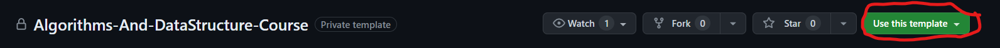

# Автоматическое тестирование (CI)

## Просьба

Пожалуйста 🙏, не отправляйте в CI решения, которые не проходят тесты (`clippy test`) локально: в CI запускаются те же самые тесты с помощью той же самой команды.

## Шаги, которые нужно выполнить 1 раз

### Регистрация

Заведите аккаунт на https://github.com/, если у вас его нет.

Не используйте в логине дефис.

### Создайте себе репозиторий с решениями используя исходный как шаблон


 
Сделайте его `приватным!` Не называйте его так же, как репозиторий курса!

### Аттач репозитория с решениями

В этот репозиторий вы будете коммитить и пушить решения (только не вручную, а через консольный клиент `clippy`), там же будут запускаться автоматические тесты.

#### Шаг 1

Перейдите в локальную копию репозитория курса:
```shell
cd /workspace/Algorithms-And-DataStructure-Course
```

#### Шаг 2

Прикрепите к репозиторию курса репозиторий с решениями:
```shell
clippy attach {solutions-repo-url}
```
Вместо `{solutions-repo-url}` подставьте url созданного только что репозитория.

Команда будет выглядеть примерно так:
```shell
clippy attach https://github.com/Maxsmile123/Algorithms-And-DataStructure-Course-Solution
```

Команду `attach` можно выполнить повторно: существующая локальная копия сотрется (с вашего явного разрешения), но это не страшно, если вы запушили все ваши коммиты с помощью `clippy push` в remote репозиторий.

### Настраиваем репозиторий решений

#### Шаг 1. Выдать мне доступ

Перейдите во вкладку `Settings` своего репозитория. Далее переходим в `Collaborators`. Нажимаем `Add people` и пишем там мой ник: ```Maxsmile123```.

Этим действием вы выдадите мне доступ на просмотр вашего репозитория.

### Настраиваем локально

#### Шаг 1. Смотрим конфиг

Выполните команду
```shell
clippy show-config
```

Вы увидите поля конфига, который нужно заполнить для посылки решений задач.

Эти поля мы заполним на последующих шагах.

#### Шаг 2. Выдайте себе PAT

На этом шаге вам нужно получить токен для работы с API https://github.com/

Для этого на https://github.com/ зайдите в `Settings` своего профиля, затем в `Developer Settings`, после в `Personal access tokens`, там нажмите `Generate new token (Classic)` после чего выберите произвольное имя для вашего токена, поставьте галки напротив (repo, admin:org), установите expiration date и нажмите `Generate token`.

См. [Personal Access Tokens](https://docs.github.com/en/authentication/keeping-your-account-and-data-secure/managing-your-personal-access-tokens)

Токен – это полученная случайная строчка из цифр и букв. Сохраните его, иначе он пропадет! Имя токена нам не понадобится.

#### Шаг 3. Запишем PAT в конфиг

Установите полученный токен в `clippy`:
```shell
# Магический разделитель -- нужен на случай дефисов в начале токена
clippy config -- github.token {your-github-token}
```

Здесь `{your-github-token}` – токен, полученный вами на предыдущем шаге.

Токен нужен `clippy` для создания pull request-ов (PR).

#### Шаг 4. Заполняем конфиг

Задайте _assignee_ для ваших PR:
```shell
# Подставьте в команду логин своего семинариста на github.com
clippy config assignee Maxsmile123
```

Настройте теги для ваших PR:
```shell
# Теги перечисляются через запятую, без лишних пробелов
# Вместо 123 подставьте номер вашей академической группы (если она у вас есть)
clippy config tags 'Labs,123'
```

Настройте группу для ваших PR:

```shell
# Вместо 123 подставьте номер вашей академической группы (если она у вас есть)
clippy config group 123
```

Настройте фамилию и имя для ваших PR:

```shell
# Вместо Maxim подставьте ваше имя
# Вместо Sysoev подставьте вашу фамилию
clippy config name.first Maxim
clippy config name.last Sysoev
```

Настройте свой ник на GitHub для ваших PR:

```shell
# Вместо Maxsmile123TEST подставьте свой ник
clippy config github.user Maxsmile123TEST
```

## Работа с задачей / репозиторием решений

#### Шаг 1

Переходим в директорию с задачей:
```shell
cd tasks/tutorial/aplusb/
```

#### Шаг 2

Решаем задачу.

#### Шаг 3

Коммитим файлы текущей задачи в отдельную ветку локального репозитория решений:
```shell
clippy commit
```

Можно указать комментарий:
```shell
clippy commit -m "yep"
```

#### Шаг 4

Пушим коммиты из локальной ветки задачи в ветку вашего приватного remote-репозитория:
```shell
clippy push
```

#### Шаг 5

Создаем [_pull request_](https://docs.github.com/en/pull-requests/collaborating-with-pull-requests/proposing-changes-to-your-work-with-pull-requests/creating-a-pull-request) ветки с решением в _master_:

```shell
# Или короче: clippy pr
clippy pull-request
```
на созданном PR будет запускаться CI.

#### Дальнейшие шаги

Пусть дальше вы нашли и исправили баги в своем коде:

```shell
# ...
clippy commit -m 'fix'
# ...
clippy commit -m 'another fix'
clippy push
```

После `push` новые коммиты попадут в уже существующий PR и перезапустят CI.

## Под капотом

Для каждой задачи в этом репозитории будет создаваться отдельная ветка (например, `tutorial/aplusb`).

Команда `clippy commit` коммитит файлы текущей задачи (см. `submit_files` в `task.json`) _локально_ в ваш репозиторий решений.

Команда `clippy push` пушит коммиты из ветки текущей задачи локального репозитория решений в remote-репозиторий.


[Документация по командам](https://github.com/Maxsmile123/Clippy/blob/master/docs%2Fcommands.md)
