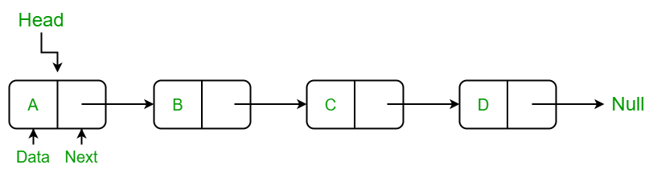

# Односвязный список

## Пререквизиты

- [lists/list](/tasks/lists/list)
---

В этой задаче напишем свой [std::forward_list](https://en.cppreference.com/w/cpp/container/forward_list).

Это список, у которого узлы связаны только одним указателем. Ходить в нём назад нельзя.

## Мотивация

Каждая Node хранит на один указатель меньше. Это позволяет занимать меньше памяти когда вам не нужно ходить в обе стороны.

**Обладает такими же свойствами, как и обычный двусвязный список:**
- Вставка элемента происходит за `O(1)`.
- Поиск элемента происходит за `O(N)`.
- Удаление элемента за `O(1)`.

## Что урезалось?
Раз мы не можем ходить назад, то мы не сможем быстро получить последний элемент списка. `PushBack` и `PopBack` также становяться недоступны.

Помимо этого, все операции вставки/удаления теперь доступны только `после` указанного итератора.

У итераторов запрещены операции декремента.

## Наследование

Можно избежать тупого Ctrl+C и Ctrl+V из двусвязного списка. Наследуйте ForwardListIterator от ListIterator из [list/iterator.hpp](../list/iterator.hpp) и запретите(`=delete`) операции, которые вам не нужны.

## Задание

Реализуйте [односвязный список](forward_list.hpp) и [итераторы](iterator.hpp) к нему.

### Указания к реализации

Старайтесь избежать копипасты из [lists/list](../list/). Декомпозируйте в общие элементы, наследуйте.

**В публичное API не стоит добавлять новых методов!**

**В публичном API не должно быть класса `Node`!**

## Примечание

В Стресс-тесте сравнится по скорости ваша реализация с `std::forward_list`.