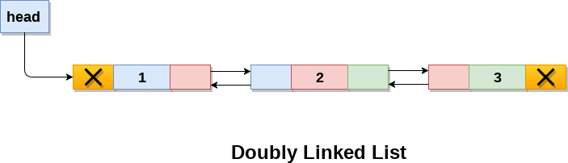
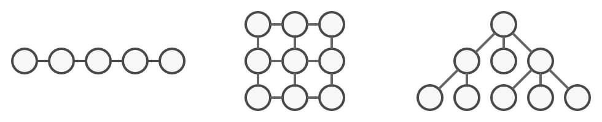
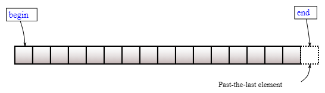

# Двусвязный список

В этой задаче напишем свой [std::list](https://en.cppreference.com/w/cpp/container/list).

---

*Двусвязный список* – структура данных, представляющая собой связанные друг за другом узлы. Двусвязный означает, что связь `двунаправленная` - текущий узел связан с следующим и предыдущим.</br>


**Обладает следующими свойствами:**
- Вставка элемента происходит за O(1).
- Поиск элемента происходит за O(N).
- Удаление элемента за O(1).

## Простые операции
```C++
// Вставить элемент в конец
void PushBack(const T&);

// Вставить элемент в начало
void PushFront(const T&);

// Удалить элемент из конца
void PopBack();

// Удалить элемент из начала
void PopFront();

// Поменять местами два списка
void Swap(List&);

// True если список пустой
bool IsEmpty();

// Вернуть кол-во элементов списка
size_t Size();

// Вернуть значение первого узла
T& Front();

// Вернуть значение последнего узла
T& Back();
```

## Итераторы

[Итератор](https://refactoring.guru/design-patterns/iterator) - это шаблон проектирования, который позволяет перемещаться по элементам контейнера, не раскрывая его базовое представление (список, стек, дерево и т. д.).

### ☹️Проблема

В программировании есть большое количество структур данных. Иногда это просто массив, иногда список. А бывают и более сложные: деревья, графы, стек.

Несмотря на всё разнообразие структур, нам нужно как-то единообразно получать доступ к элементам. При этом хочется получать доступ к следующему элементу, не обращаясь снова и снова к предыдущим.

### 😊Решение

Основная идея шаблона «Итератор» заключается в выделении поведения обхода коллекции в отдельный объект, называемый `итератором`.

Пользователь не думает о том, как устроена структура данных под ним, а имеет единый интерейс к получению данных и `итерированию` по коллекции.

### Интерфейс

```C++
template <typename Node>
class ListIterator {
public:
    // Сравнить на равенство два итератора
    bool operator==(const ListIterator&);

    // Сравнить на неравенство два итератора
    bool operator!=(const ListIterator&);

    // Получить значение текущей Node
    typename Node::value_type& operator*();

    // Проитерироваться вперёд на один шаг
    ListIterator& operator++();

    // Префиксная версия
    ListIterator operator++(int); 

    // Проитерироваться назад на один шаг
    ListIterator& operator--();

    // Префиксная версия
    ListIterator operator--(int);

private:
    ListIterator(const Node*);
    /*The overload of operator -> must either return a raw pointer, 
    or return an object (by reference or by value) for which 
    operator -> is in turn overloaded.*/
    typename Node::value_type* operator->();
private:
    Node* current;
};

```

### Указания по реализации

Прочтите о том, [как перегружать операторы](https://en.cppreference.com/w/cpp/language/operators) в C++.

Думайте об операторе как о обычном методе класса.

[Writing a custom iterator in modern C++](https://www.internalpointers.com/post/writing-custom-iterators-modern-cpp)

## Операции с итераторами в списке



- `ListIterator<Node> Begin()` - Вернуть итератор на первый элемент.

- `ListIterator<Node> End()` - Вернуть итератор `следующий после последнего элемент`. См. картинку выше

- `void Erase(ListIterator<Node>)` - Удалить элемент по переданному итератору.

- `void Insert(ListIterator<Node>, const T&)` - Вставить новый элемент до переданного итератора.

## Задание

Реализуйте [список](list.hpp) и [итераторы](iterator.hpp) к нему.

### Указания к реализации

Чтобы лучше понять ожидаемое поведение, посмотрите [тесты](tests/unit.cpp).

**В публичное API не стоит добавлять новых методов!**

**В публичном API не должно быть класса `Node`!** 

`std::initializer_list` позволяет передавать список элементов</br>
[How to create a constructor initialized with a list?](https://stackoverflow.com/questions/21869208/how-to-create-a-constructor-initialized-with-a-list)

Строки `friend class ListIterator<Node>` означают, что класс `ListIterator<Node>` имеет доступ к приватным полям и методам текущего класса, т.е. являеттся его [другом](https://en.cppreference.com/w/cpp/language/friend)

## References
- [Iterator pattern](https://refactoring.guru/design-patterns/iterator)
- [To Be or Not to Be (an Iterator)](https://ericniebler.com/2015/01/28/to-be-or-not-to-be-an-iterator/)

## Примечание

В Стресс-тесте сравнится по скорости ваша реализация с `std::list`.